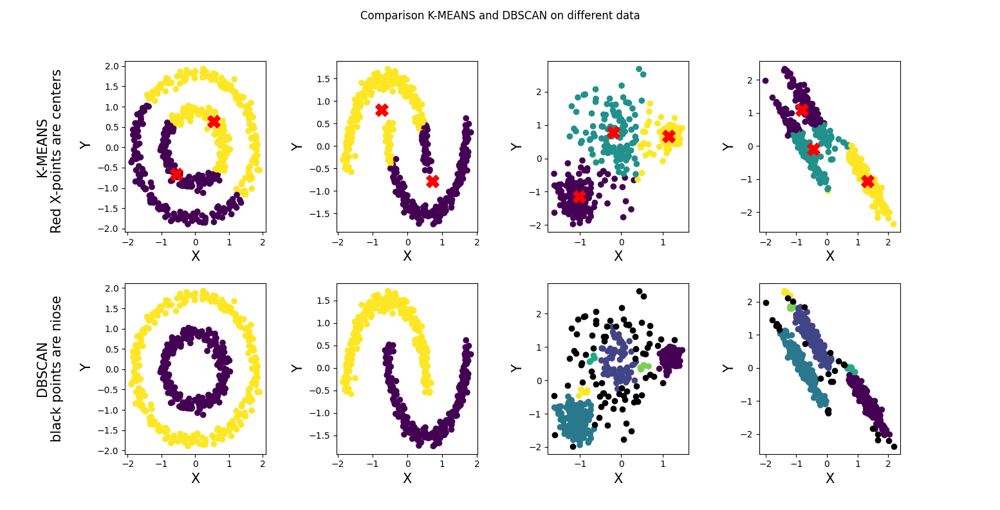

# Comparsion k-means and Dbscan :
* CLUSTERING : It is basically a type of unsupervised learning method. An unsupervised learning method is a method in which we draw references from datasets consisting of input data without labeled responses.
clustering is the task of dividing the population or data points into a number of groups such that data points in the same groups are more similar to other data points in the same group and dissimilar to the data points in other groups. It is basically a collection of objects on the basis of similarity and dissimilarity between them. 

* K-MEANS : K-means clustering is a method used for clustering analysis, especially in data mining and statistics. It aims to partition a set of observations into a number of clusters (k), resulting in the partitioning of the data into Voronoi cells. It can be considered a method of finding out which group a certain object really belongs to.
The algorithm:
1-K points are placed into the object data space representing the initial group of centroids.
2-Each object or data point is assigned into the closest k.
3-After all objects are assigned, the positions of the k centroids are recalculated.
4-Steps 2 and 3 are repeated until the positions of the centroids no longer move.

* DBSCAN: "Density-based Spatial Clustering of Applications with Noise".
Density-Based Clustering refers to unsupervised learning methods that identify distinctive groups/clusters in the data, based on the idea that a cluster in data space is a contiguous region of high point density, separated from other such clusters by contiguous regions of low point density.

Density-Based Spatial Clustering of Applications with Noise (DBSCAN) is a base algorithm for density-based clustering. It can discover clusters of different shapes and sizes from a large amount of data, which is containing noise and outliers.

## My Project:
* DATA : by sklearn i created four data in different shape, like :  moon, blob, circle and line.

* CODE : i developed a K-means class , whereas i used sklearn for Dbscan.
According to the number of clusters, i randomly selected data samples as centers and then measured the distance of the total data to each of these centers. i used to update the center of mass until the center does not change.
After preparing the data and creating the k-means class and modeling from Dbscan,i have given each data set as input once to k-means and once to Dbscan and displayed the output.

* TIP : To apply Cummins on each data set, a video of the clustering completion process is made. the videos are in data/output  folder.

#### figures and videos :
* figure_1

                                       