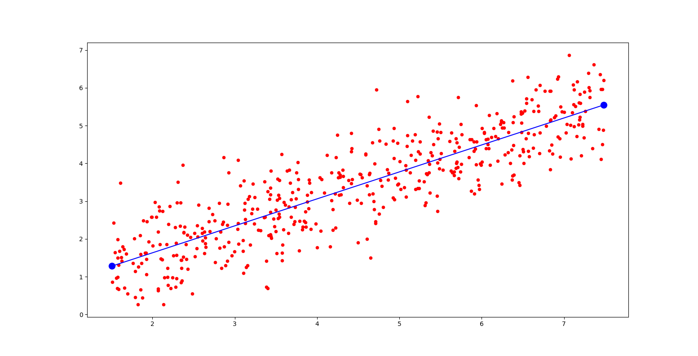

# Simple Linear Regrassion:
SLR or simple linear regression analysis is used to predict the value of a variable based on the value of another variable. The variable you want to predict is called the dependent variable. The variable you are using to predict the other variable's value is called the independent variable.

## my project:
i worked on data that has one independent parameters.
this data is about people income and rate them happiness.
income is independent parameter and rate happiness is  depended it.

### my code:
i used to "Ordinary Least Squares (OLS)" method.linear regression formula is # [Y = Beta_0 + Beta_1*X + e]
* Y = depended value (rate happiness)
* BETA_0 = Width from the origin
* BETA_1 = line slope
* X = independed value (income)
* e = error
i need to BETA_0 and BETA_1 so i used to OLS method to find them ( you can study OLS method in this linke :
https://towardsdatascience.com/understanding-the-ols-method-for-simple-linear-regression-e0a4e8f692cc )

and also i used to "Root Mean Squared Error"  to find my code predect error.

#### figure:

