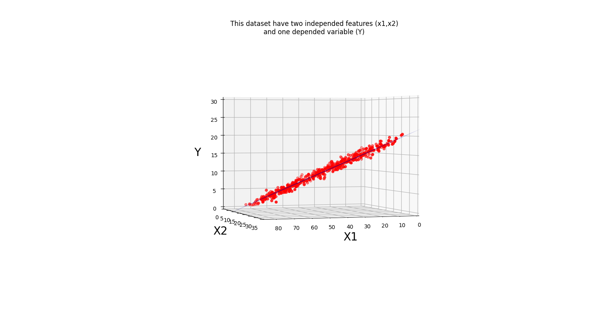
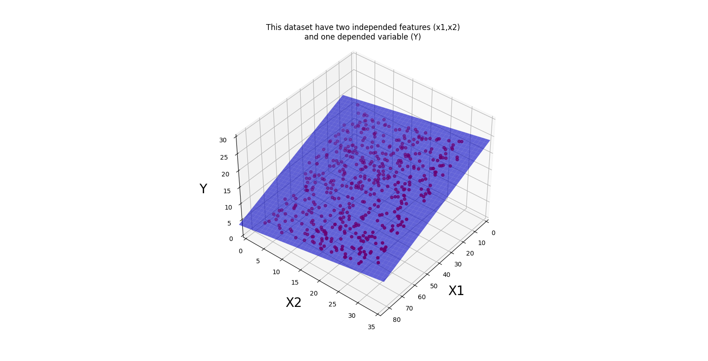
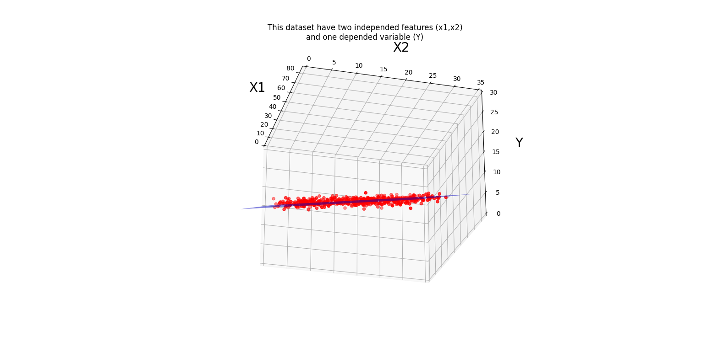

# Multiple Linear Regression by Pythorch:
You can study MLR definition in MLR project folder; and also:
PyTorch is an open source machine learning library that specializes in tensor computations, automatic differentiation, and GPU acceleration. For those reasons, PyTorch is one of the most popular deep learning libraries.

## My Project:
* Dataset : My dataset is the one i used for the MLR project >>> :https://cdn.scribbr.com/wp-content/uploads//2020/02/heart.data_.zip
### Code :
* step_1 : Read the dataset and set the properties and labels in the x_data,y_data values as a tensor. 
* step_2 : defining nn.linear regression class of torch library with  input size of features.
* step_3 : set other parameters, like: Learning reat, bachsize, number of epoch and etc.
* step_4 : define model,criterion,optimizer. i used to MSE loss function for criterion, and Adam method for optimizer.
* step_5 : In the main part of the code i have implemented two "for" loops. in each iteration of the inner loop, i give a batch size of data to the input of the model and for each specified number of outer loop i drew the plane using grid parameters and saved the figure.
and finally, i made a video from the saved figures as the output of the model.
* important point : you have to tion tha parameters (Learning reat, batch size,n_epoch) according to your dataset.

## Demo1:
This is an output video created from the  some selected epoch
[)](https://youtu.be/AL0ZHEvjZQo)

##### The final figure from different angles:

