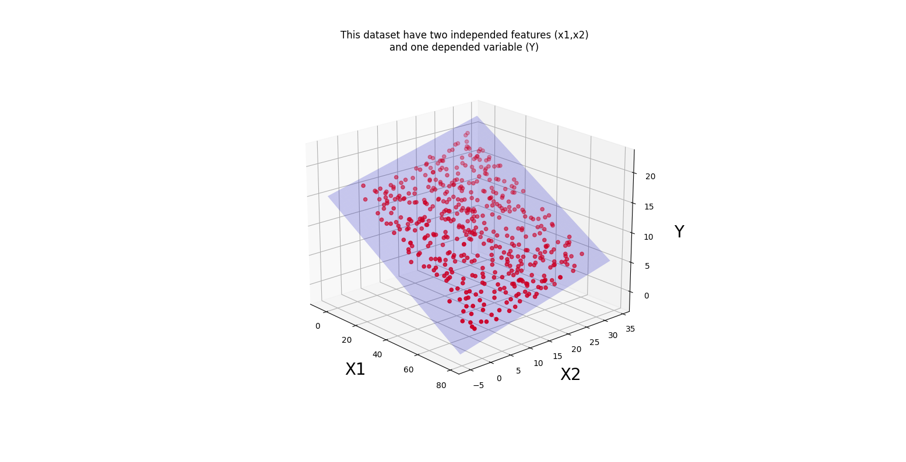
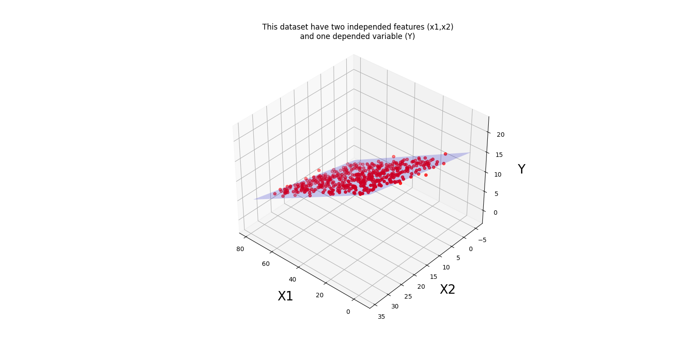
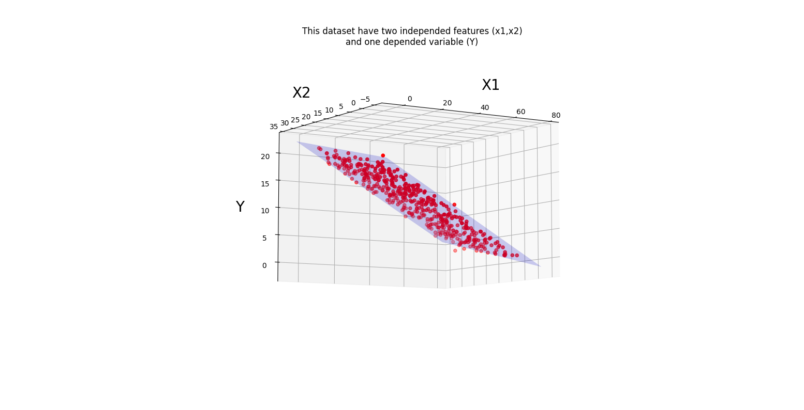

# Multiple Linear Regrassion (MLR):
Multiple linear regression refers to a statistical technique that is used to predict the outcome of a variable based on the value of two or more variables. It is sometimes known simply as multiple regression, and it is an extension of linear regression. The variable that we want to predict is known as the dependent variable, while the variables we use to predict the value of the dependent variable are known as independent or explanatory variables.

## My Dataset:
*  The dataset i used is about the effect of smoking and cycling on heart disease.This dataset contains the information of 500 people from different cities. Who smokes? Who goes to work by bicycle? And finally, who has heart disease? >>> you can use to follow link to  download this dataset: https://cdn.scribbr.com/wp-content/uploads//2020/02/heart.data_.zip

## My Code:
* general equation for MLR is : 
 Y = theta_0 + theta_1 * X1 + theta_2 * X2 + ....+ theta_n * Xn
* Normal Equation to find Coefficients(thetas): thetas = (X.T X)^-1 X.T Y
 
* Train : you must calculate theta with the normal equation. It is not very difficult; You can use the numpy library. Of course, you should pay attention to the shape of arrays and vectors.
After applying the formula on the dataset, a vector is obtained, the first index of which is the intersect and the rest of the values ​​are coefficients.

* Prediction : For the test predict a presentation in the dimensions of the number of test samples in the number of features should be multiplied by the theta vector (the vector resulting from the normal formula). 
after this a vector is obtained, this vector is your algorithm predict.

* error : i use to  Root Mean Squared Error method (RMSE)

### some figures:

