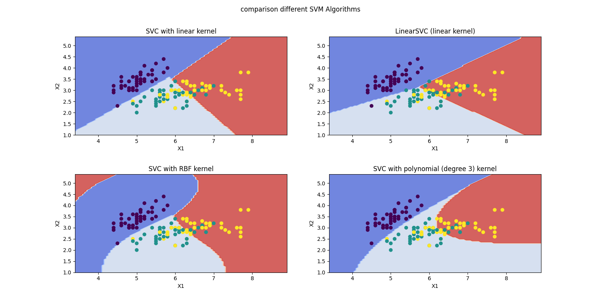

# Support Vector Machine:
A support vector machine (SVM) is a type of deep learning algorithm that performs supervised learning for classification or regression of data groups.like other supervised learning machines, an SVM requires labeled data to be trained. Groups of materials are labeled for classification. Training materials for SVMs are classified separately in different points in space and organized into clearly separated groups. After processing numerous training examples, SVMs can perform unsupervised learning. The algorithms will try to achieve the best separation of data with the boundary around the hyperplane being maximized and even between both sides.

## My Code :
I used iris dataset as np file, you can download it as csv file from below link and then convert to np format in text.  LINK : https://archive.ics.uci.edu/ml/machine-learning-databases/iris/

i used sklearn library and its SVM . Linear svm ,Rbf svm, Poly svm ; i applied two columns of iris on them.

### Result:

